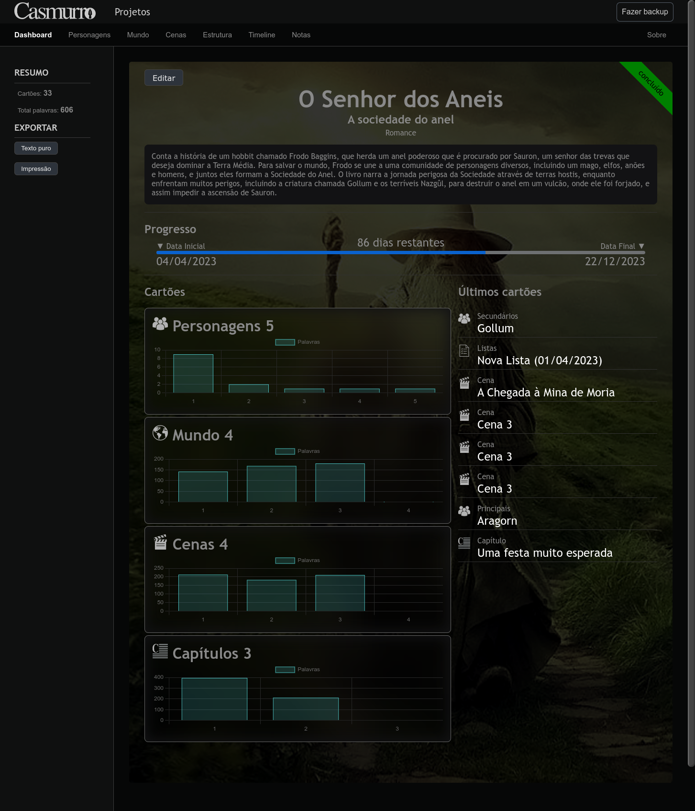

## Plataforma para planejamento de ficção

Casmurro é um projeto *open source* (totalmente gratuito e livre) que visa ajudar escritores em todas as etapas da criação de ficção. Ele foi desenvolvido para ser usado como uma segunda tela, auxiliando durante o período de preparação e pesquisa, assim como no momento da escrita.

Com o objetivo de tornar o processo de criação mais organizado e prazeroso, o projeto foi iniciativa de um escritor para outros escritores. O Casmurro oferece uma série de ferramentas para auxiliar na construção e planejamento de todos os aspectos relacionados à criação de ficção, incluindo personagens, cenários, diálogos e enredos.

Sinta-se livre para explorar as ferramentas e recursos oferecidos pelo Casmurro. Esperamos que possa ser uma ferramenta valiosa para todos os escritores, independentemente do nível de experiência.

